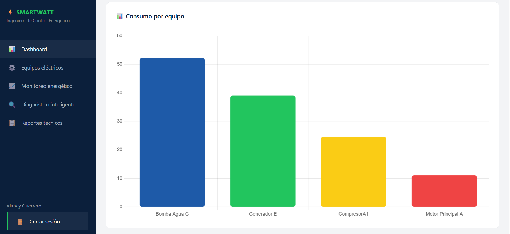
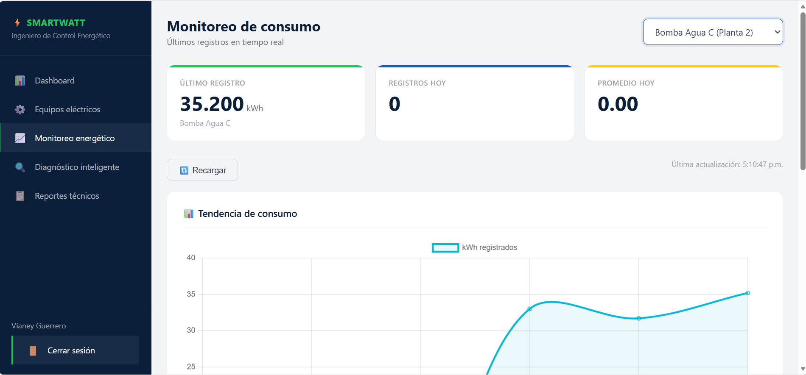
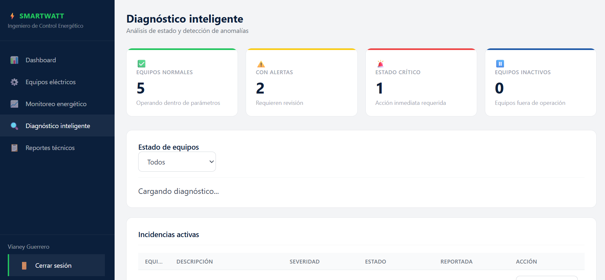

# SmartWatt Diagnostics

<p align="center">
  
</p>

Sistema de monitoreo y análisis energético orientado a la supervisión operativa y análisis técnico de equipos eléctricos dentro de instalaciones industriales.

---

## Descripción

SmartWatt Diagnostics es una plataforma desarrollada para centralizar información energética, registrar incidencias técnicas y facilitar el monitoreo operativo mediante dashboards, diagnósticos y generación de reportes.

El sistema permite visualizar el comportamiento energético de equipos eléctricos y apoyar la toma de decisiones dentro de una instalación.

---

## Objetivo

Desarrollar una plataforma que permita registrar, monitorear y analizar información energética y operativa de equipos eléctricos para mejorar la supervisión técnica.

---

## Funcionalidades principales

- Monitoreo energético.
- Dashboard de indicadores.
- Gestión de equipos eléctricos.
- Registro de incidencias técnicas.
- Diagnóstico energético.
- Generación de reportes PDF.
- Gestión de usuarios.

---

## Capturas del sistema

### Dashboard



---

### Monitoreo energético



---

### Diagnóstico



---

## Tecnologías utilizadas

| Tecnología | Uso |
|---|---|
| Python | Backend |
| Flask | Servidor |
| SQLite | Base de datos |
| HTML | Interfaz |
| CSS | Diseño |
| JavaScript | Funcionalidad |
| ReportLab | Reportes PDF |
| GitHub | Control de versiones |
| Ubuntu WSL2 | Entorno |

---

## Requisitos del sistema

### Requisitos de hardware

| Componente | Requisito mínimo |
|---|---|
| Procesador | Dual Core 2.0 GHz |
| Memoria RAM | 4 GB |
| Almacenamiento | 500 MB disponibles |
| Pantalla | 1366×768 |

### Requisitos de software

| Software | Versión |
|---|---|
| Sistema operativo | Windows 10/11 o Ubuntu |
| Python | 3.14 o superior |
| Flask | 3.0.0 |
| SQLite | Integrado |
| Git | Última versión |
| Visual Studio Code | Recomendado |
| Navegador | Chrome, Edge o Firefox |
| Entorno Linux | WSL2 |

La instalación completa puede consultarse en:

→ [Manual de instalación](docs/instalacion.md)

---

## Organización del repositorio

```text
SmartWatt-Diagnostics/
├── backend/
├── frontend/
├── database/
├── docs/
├── main.py
└── requirements.txt
```
La estructura detallada del sistema puede consultarse en:

→ [Arquitectura del sistema](docs/arquitectura.md)

---

## Documentación

| Documento | Contenido |
|---|---|
| docs/instalacion.md | Instalación y ejecución |
| docs/entorno-desarrollo.md | Configuración del entorno |
| docs/flujo-github-flow.md | Flujo de trabajo GitHub |
| docs/arquitectura.md | Arquitectura del sistema |
| docs/uso-del-sistema.md | Manual de uso |

---

## Flujo de trabajo

El desarrollo del proyecto fue organizado utilizando GitHub Flow.

Consultar:

→ [Flujo GitHub](docs/flujo-github-flow.md)

---

## Uso del sistema

La descripción de módulos y funcionamiento del sistema puede consultarse en:

→ [Manual de uso](docs/uso-del-sistema.md)

---

## Entorno de desarrollo

Configuración utilizada:

- Visual Studio Code
- Ubuntu (WSL2)
- Python 3.14
- Entorno virtual (venv)

Más información:

→ [Entorno de desarrollo](docs/entorno-desarrollo.md)

---

## Autores

Proyecto desarrollado por:

- Diego Martínez Morales  
- Vianey Guerrero Reyes  
- Luis Jaziel Basilio Cruz 
- Andy Najai Vazquez Garcia

---

## Licencia

Este proyecto fue desarrollado exclusivamente con fines académicos.

La licencia y condiciones de uso pueden consultarse en el archivo:

[LICENSE](LICENSE)
