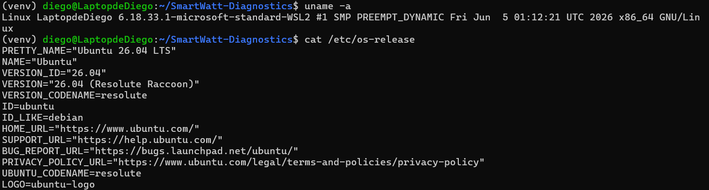
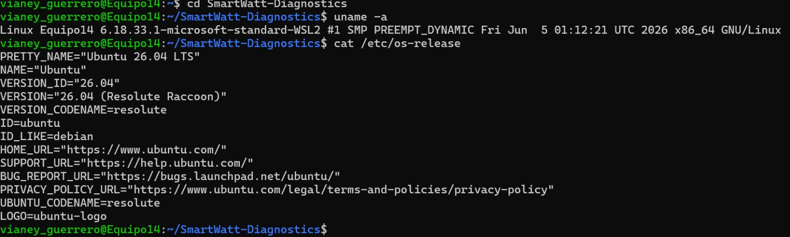
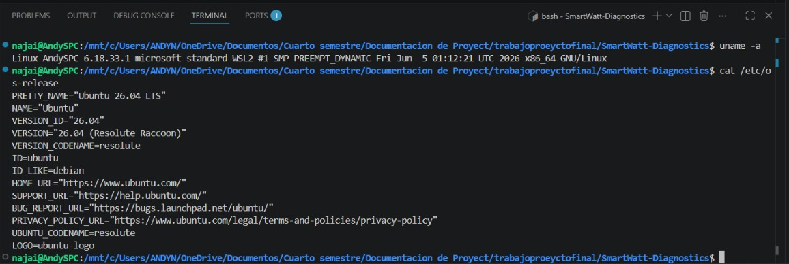
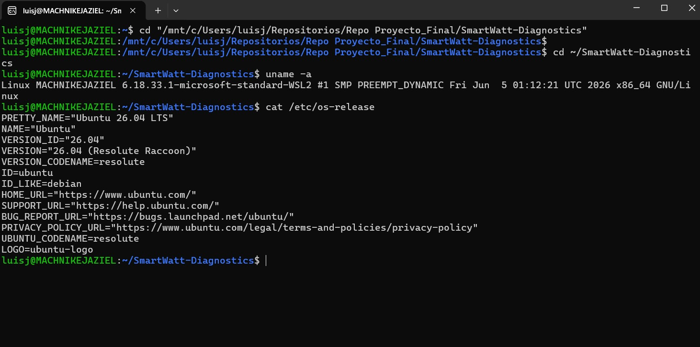
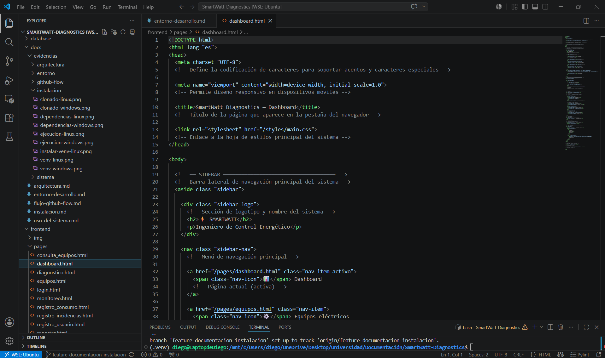
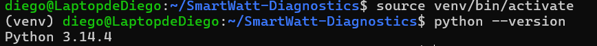
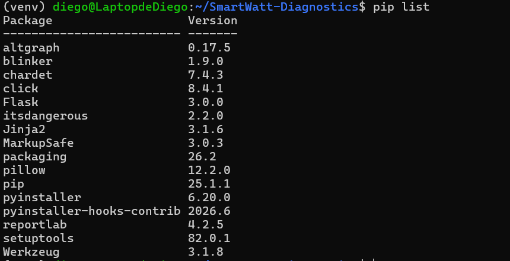
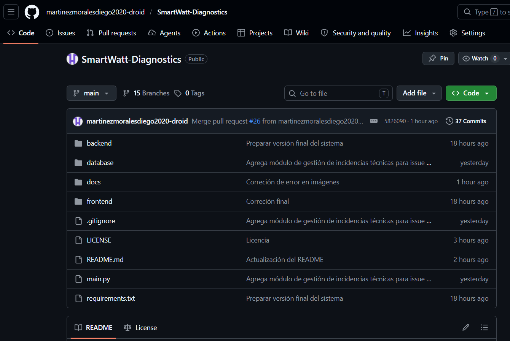

# Entorno de desarrollo

## Objetivo

Documentar el entorno utilizado para el desarrollo, pruebas y ejecución del sistema SmartWatt Diagnostics.

---

## Sistema operativo

El desarrollo del proyecto se realizó utilizando un entorno híbrido compuesto por Windows y Linux mediante Windows Subsystem for Linux (WSL2).

### Configuración utilizada

| Componente        | Configuración |
| ----------------- | ------------- |
| Sistema principal | Windows 11    |
| Entorno Linux     | Ubuntu (WSL2) |
| Arquitectura      | x64           |

---

## Evidencias de trabajo en WSL2

Cada integrante trabajó dentro del entorno Linux (WSL2), comprobado mediante terminal activa, usuario y directorio del proyecto.

### Integrante 1


### Integrante 2


### Integrante 3


### Integrante 4


---

## Entorno de programación

Para el desarrollo del sistema se utilizó Visual Studio Code como editor principal.

### Herramientas utilizadas

| Herramienta        | Uso                     |
| ------------------ | ----------------------- |
| Visual Studio Code | Desarrollo              |
| Git                | Control de versiones    |
| GitHub             | Gestión del repositorio |
| Terminal Ubuntu    | Ejecución               |



---

## Lenguajes y tecnologías

Las tecnologías utilizadas durante el desarrollo fueron las siguientes:

| Tecnología | Función                |
| ---------- | ---------------------- |
| Python     | Backend                |
| Flask      | Servidor               |
| SQLite     | Base de datos          |
| HTML       | Interfaz               |
| CSS        | Diseño                 |
| JavaScript | Funcionalidad          |
| ReportLab  | Generación de reportes |

---

## Configuración de Python

Se utilizó Python dentro de un entorno virtual para aislar dependencias del proyecto.

### Versión utilizada

```bash
python --version
```

Resultado esperado:

```text
Python 3.14
```



---

## Entorno virtual

Se utilizó un entorno virtual para administrar dependencias.

Creación:

```bash
python -m venv venv
```

Activación Linux:

```bash
source venv/bin/activate
```

Activación Windows:

```bash
venv\Scripts\activate
```

Verificación:

```text
(venv)
```



---

## Organización del proyecto

La estructura del repositorio fue administrada utilizando Git y GitHub.

Consultar:

[Arquitectura del sistema](arquitectura.md)



---

## Resultado

El entorno permitió desarrollar, probar y ejecutar correctamente el sistema SmartWatt Diagnostics tanto en Windows como en Linux mediante WSL2.
