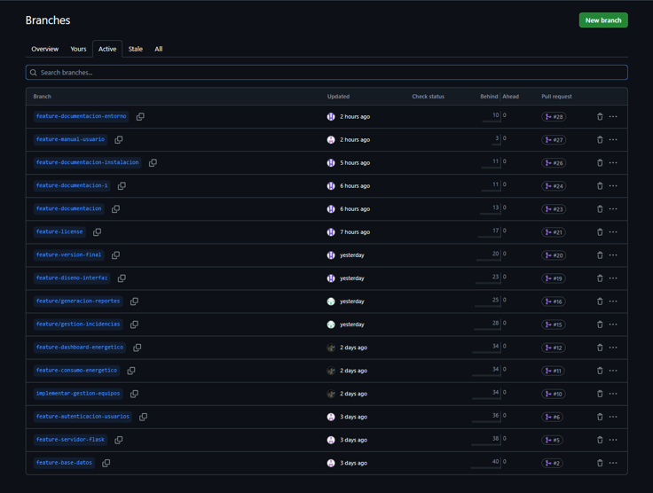
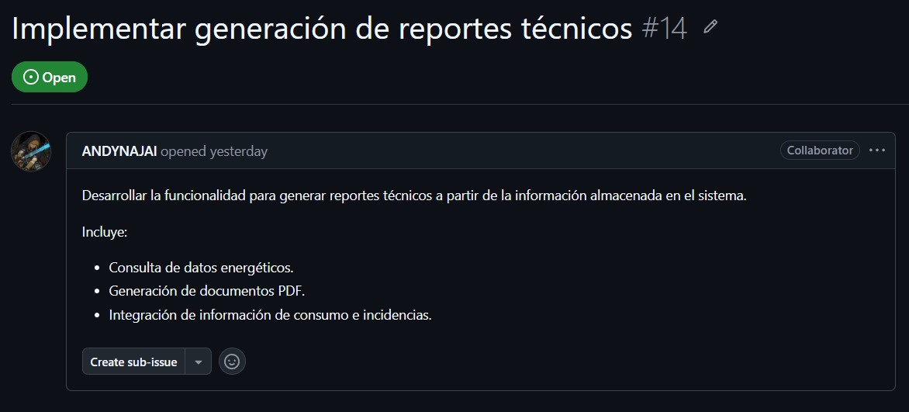
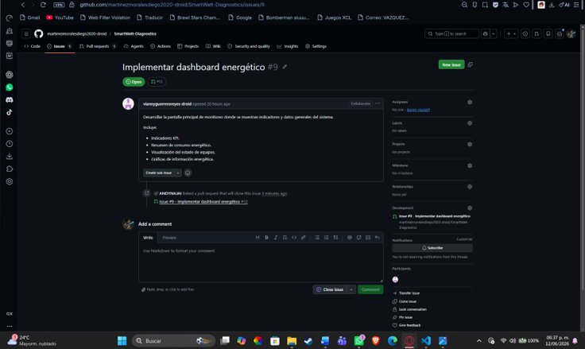
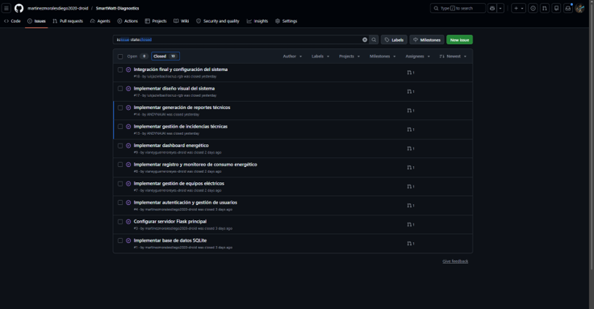
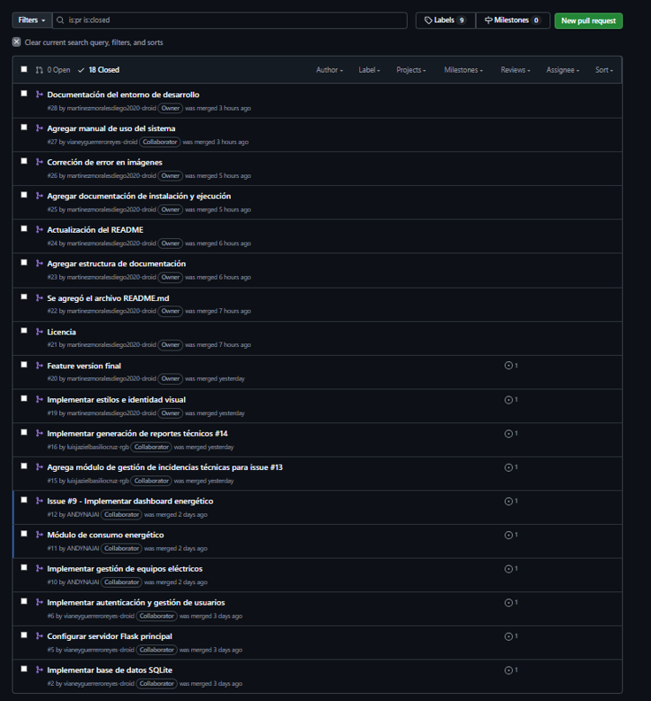
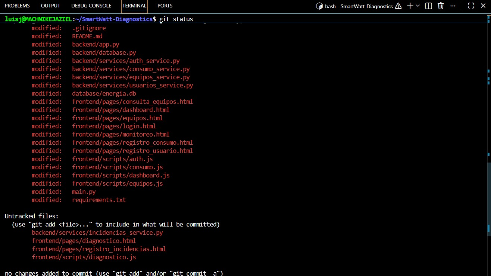
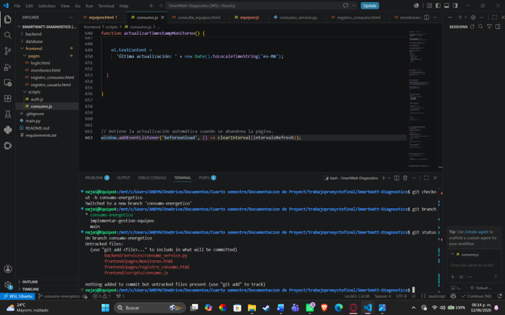
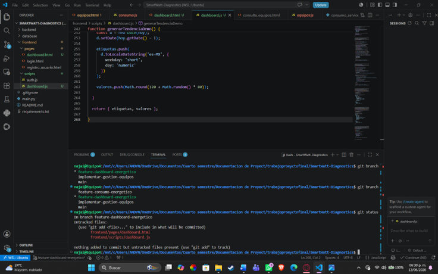

# Flujo de Trabajo con GitHub Flow

## 1. Introducción

En el desarrollo de este proyecto de software se trabajó de forma colaborativa mediante un repositorio alojado en GitHub. Debido a que el equipo estuvo conformado por cuatro integrantes y las tareas se distribuyeron a través de *Issues*, fue necesario adoptar un flujo de trabajo que permitiera organizar los cambios, revisar el código antes de integrarlo y mantener estable la rama principal del proyecto.

Para ello se utilizó **GitHub Flow**, una estrategia de trabajo que consiste en crear una rama por cada tarea o mejora, realizar los cambios necesarios, abrir una *Pull Request*, revisar y validar la propuesta, y finalmente integrar los cambios a la rama principal (`main`).

---

## 2. ¿Por qué se eligió GitHub Flow?

GitHub Flow fue la opción más adecuada para este proyecto porque permite trabajar de manera simple y ordenada sin complicar el proceso con demasiadas ramas permanentes. Este flujo funciona bien cuando el equipo necesita avanzar por tareas pequeñas o medianas, como en este caso, donde cada integrante tomó un *Issue* específico y desarrolló su parte en una rama independiente.

Las principales razones de su elección fueron las siguientes:

- Facilita la colaboración entre varios integrantes.
- Permite asignar tareas mediante *Issues* y darles seguimiento.
- Cada cambio se desarrolla en una rama separada, lo que reduce riesgos sobre la rama principal.
- Antes de integrar cambios, se revisa el código mediante *Pull Requests*.
- Mantiene una trazabilidad clara entre *Issue*, rama, *Commits* y *Merge*.

---

## 3. ¿Cómo se aplicó en el proyecto?

En el proyecto, el trabajo se organizó de la siguiente manera:

1. Se creó o asignó un *Issue* para cada tarea.
2. Cada integrante tomó un *Issue* y creó una rama con un nombre relacionado con la actividad.
3. Se realizaron los cambios solicitados en archivos del proyecto.
4. Se hicieron *Commits* con mensajes descriptivos.
5. Se abrió una *Pull Request* para revisar el trabajo.
6. Una vez validado, la rama se fusionó con `main`.

Este proceso permitió que cada contribución quedara registrada y que el equipo pudiera comprobar fácilmente qué se hizo, quién lo realizó y en qué rama se integró.

---

## 4. Evidencias del uso de GitHub Flow

A continuación se muestran las evidencias que respaldan el uso de este flujo de trabajo dentro del repositorio.

### 4.1 Evidencia de ramas creadas

Las ramas muestran que cada tarea fue desarrollada de forma independiente. Esto es una característica central de GitHub Flow, ya que evita que varios cambios se mezclen directamente en `main`.

---

### 4.2 Evidencia de Issues utilizados para organizar el trabajo

Los *Issues* sirvieron para asignar tareas específicas a cada integrante y dar seguimiento a su avance. Esto demuestra que el proyecto no se trabajó de manera improvisada, sino con una organización previa de actividades.

*Figura 4.2. Evidencia del ciclo de vida de un Issue dentro del repositorio: creación de la tarea, resolución de la actividad asignada y cierre del Issue una vez completado el trabajo.*

---

### 4.3 Evidencia de Pull Requests y Merge

Las *Pull Requests* permiten revisar los cambios antes de integrarlos a la rama principal. En este proyecto, cada contribución pasó por este proceso para validar que el código o la documentación fueran correctos antes del *Merge*.

---

### 4.4 Evidencia de cambios realizados por los integrantes

A continuación, se presentan algunas evidencias de los cambios y aportaciones efectuadas por los integrantes del equipo dentro del repositorio (una pequeña muestra). Las capturas muestran parte del trabajo desarrollado durante la implementación del proyecto, permitiendo identificar las modificaciones realizadas y los resultados obtenidos a partir de las actividades asignadas, asi mismo se evidencia el flujo de trabajo en lo explicado anteriormente.

#### Cambios realizados 

#### 

---

## 5. Relación entre ramas, Issues y Pull Requests

La siguiente relación resume cómo se trabajó en el repositorio:

- Un *Issue* definía la tarea a realizar.
- Una rama representaba el espacio de trabajo para esa tarea.
- Los *Commits* registraban los avances realizados.
- La *Pull Request* permitía la revisión del cambio.
- El *Merge* incorporaba el resultado final a `main`.

Este esquema demuestra claramente la aplicación de GitHub Flow, ya que cada modificación siguió un ciclo de trabajo controlado y verificable.

---

## 6. Beneficios obtenidos

El uso de GitHub Flow aportó varias ventajas al proyecto:

- Mejor organización del trabajo en equipo.
- Separación clara entre desarrollo y versión estable.
- Mayor control sobre los cambios realizados.
- Facilita la revisión antes de integrar código o documentación.
- Permite dejar evidencia clara del proceso de desarrollo.

---

## 7. Conclusión

GitHub Flow fue el flujo de trabajo adecuado para este proyecto porque permitió coordinar las tareas entre los integrantes, trabajar de manera ordenada por medio de *Issues* y ramas, y validar cada cambio antes de incorporarlo a la rama principal.

Gracias a este proceso se obtuvo una colaboración más clara, un historial bien documentado y una integración final más segura.

Además, las capturas de ramas, *Issues* y *Pull Requests* sirven como evidencia concreta de que el equipo sí aplicó este flujo de trabajo durante el desarrollo del software.