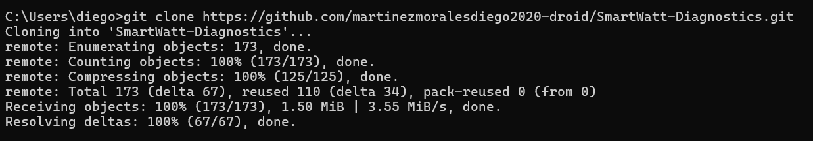
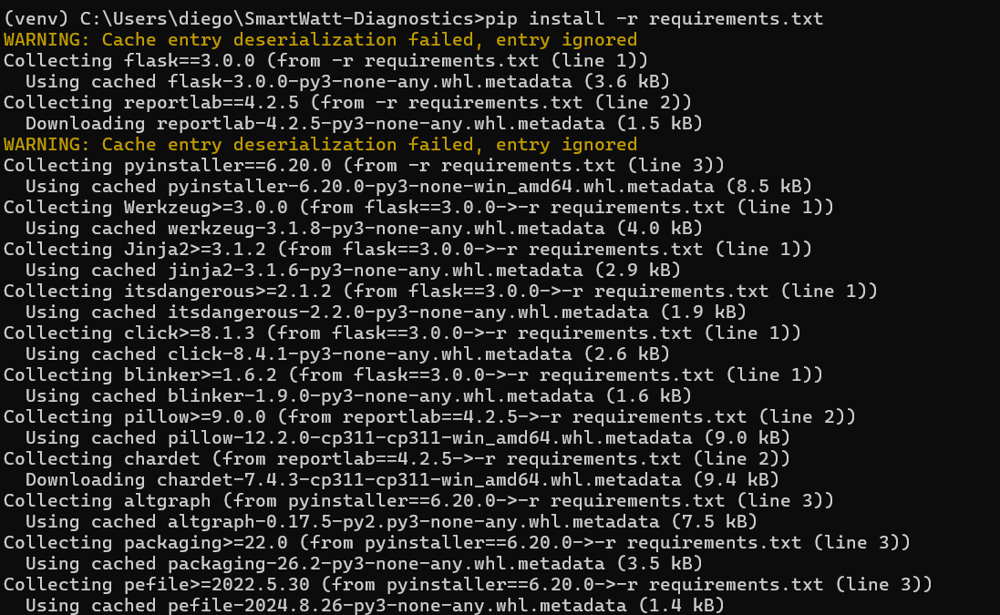
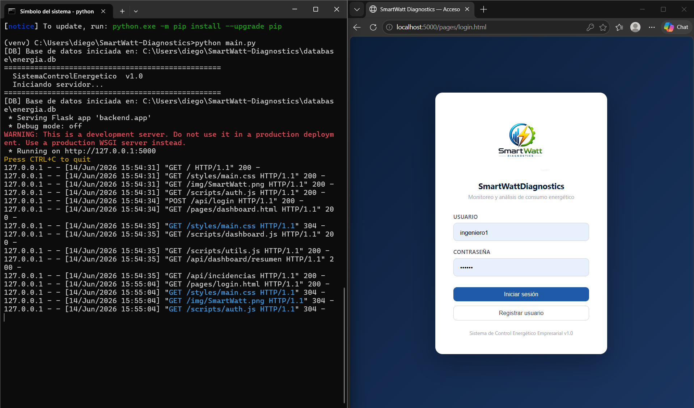
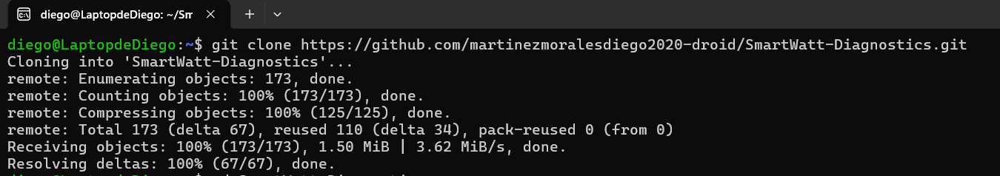
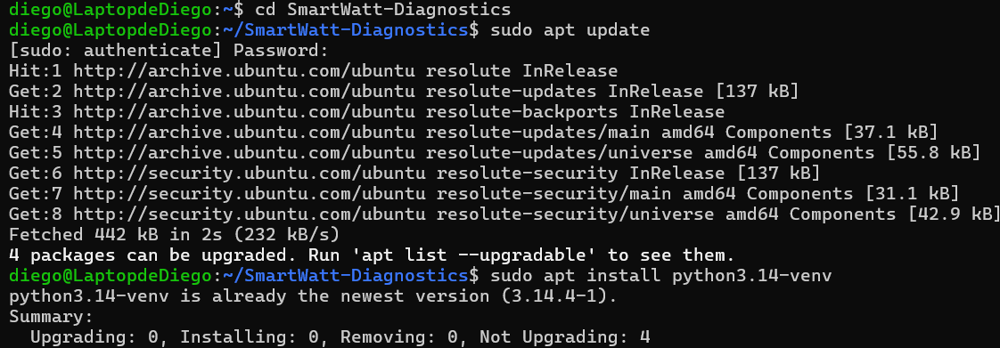
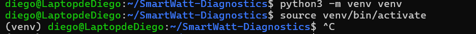
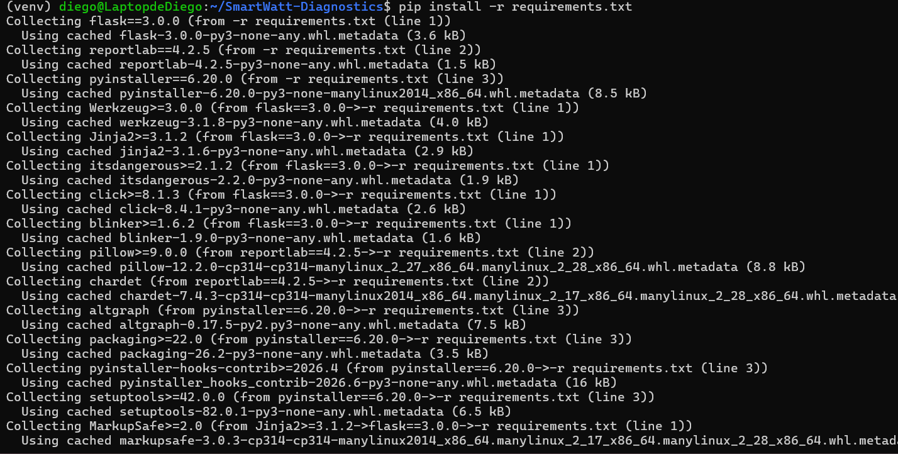
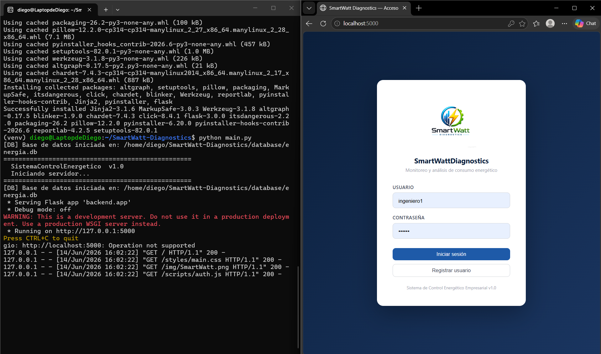

# Instalación y ejecución

## Objetivo

Este documento describe el procedimiento de instalación y ejecución del sistema SmartWatt Diagnostics en Windows y Linux.

---

## Requisitos previos

### Hardware

| Componente | Requisito mínimo |
|---|---|
| Procesador | Dual Core 2.0 GHz |
| Memoria RAM | 4 GB |
| Almacenamiento | 500 MB disponibles |
| Pantalla | 1366×768 |

### Software

| Software | Versión |
|---|---|
| Python | 3.14 o superior |
| Git | Última versión |
| Visual Studio Code | Recomendado |
| Navegador | Chrome, Edge o Firefox |
| Sistema operativo | Windows 10/11 o Ubuntu |
| Entorno Linux | WSL2 |

---

## Instalación y ejecución en Windows

### 1. Clonar repositorio

```bash
git clone https://github.com/martinezmoralesdiego2020-droid/SmartWatt-Diagnostics.git
```


---

### 2. Entrar al proyecto

```bash
cd SmartWatt-Diagnostics
```

---

### 3. Crear entorno virtual

```bash
python -m venv venv
```

---

### 4. Activar entorno virtual

```bash
venv\Scripts\activate
```

Verificar:

```text
(venv)
```



---

### 5. Instalar dependencias

```bash
pip install -r requirements.txt
```



---

### 6. Ejecutar sistema

```bash
python main.py
```

Abrir:

```text
http://localhost:5000
```



---

## Instalación y ejecución en Linux (Ubuntu / WSL2)

### 1. Abrir terminal Ubuntu

---

### 2. Clonar repositorio

```bash
git clone https://github.com/martinezmoralesdiego2020-droid/SmartWatt-Diagnostics.git
```



---

### 3. Entrar al proyecto

```bash
cd SmartWatt-Diagnostics
```

---

### 4. Instalar entorno virtual

```bash
sudo apt update
sudo apt install python3.14-venv
```



---

### 5. Crear entorno virtual

```bash
python3 -m venv venv
```

---

### 6. Activar entorno

```bash
source venv/bin/activate
```

Verificar:

```text
(venv)
```



---

### 7. Instalar dependencias

```bash
pip install -r requirements.txt
```



---

### 8. Ejecutar sistema

```bash
python main.py
```

Abrir manualmente:

```text
http://localhost:5000
```



---

## Problemas comunes

### Error: No module named flask

```bash
pip install -r requirements.txt
```

---

### Error: ensurepip is not available

```bash
sudo apt install python3.14-venv
```

---

### El navegador no abre automáticamente en WSL2

Abrir manualmente:

```text
http://localhost:5000
```