# Descripción funcional del sistema

## Inicio de sesión

La pantalla de inicio de sesión constituye la puerta de acceso principal al sistema. Su función es permitir que los usuarios registrados ingresen a la plataforma utilizando las credenciales previamente almacenadas en la base de datos.

En la parte central de la interfaz se encuentra el formulario de autenticación, compuesto por los siguientes campos:

- **Usuario:** permite ingresar el nombre de usuario registrado en el sistema.
- **Contraseña:** permite ingresar la contraseña asociada a la cuenta del usuario.

Debajo del formulario se encuentran las siguientes opciones:

- **Iniciar sesión:** valida las credenciales ingresadas y permite el acceso a la plataforma.
- **Registrar usuario:** dirige al usuario hacia la pantalla de registro para crear una nueva cuenta.

  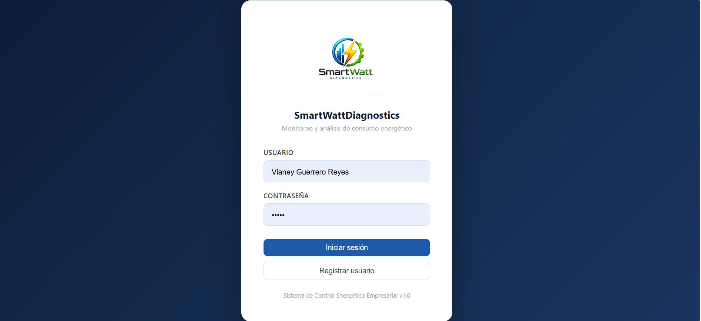

<b>Figura 1.</b> Pantalla de inicio de sesión.

### Registro de usuario

Al seleccionar la opción Registrar usuario, el sistema muestra una nueva ventana donde se solicitan los datos necesarios para la creación de una cuenta.

El formulario de registro contiene los siguientes campos:

- **Nombre de usuario**
- **Contraseña**
- **Rol**

El campo Rol corresponde a una lista desplegable que permite seleccionar una de las siguientes opciones:

- **Ingeniero de Control Energético**
- **Técnico de Monitoreo**
  

Una vez completada la información, el usuario puede presionar el botón Registrar para almacenar los datos en la base de datos del sistema.

  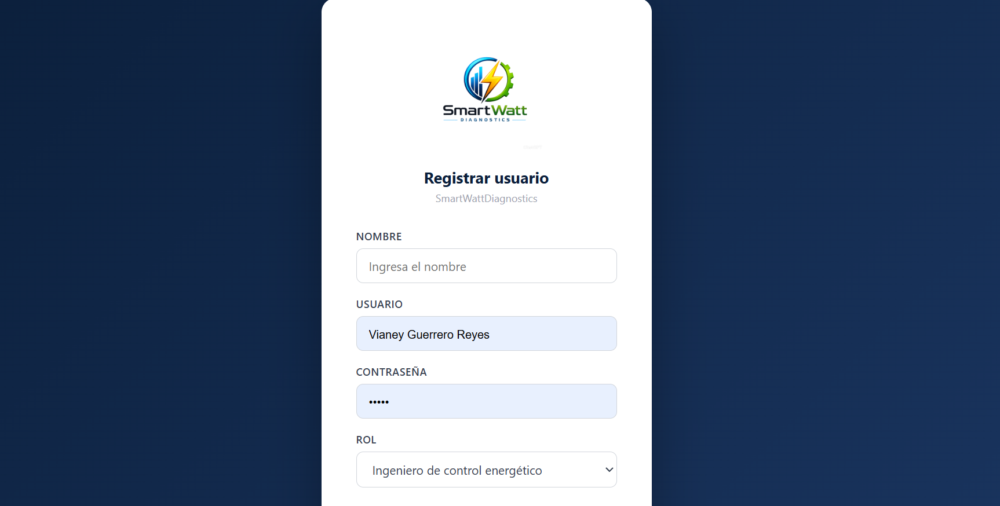

<b>Figura 2.</b> Registro de usuario.

Después de realizar el registro, el usuario puede regresar a la pantalla de inicio de sesión e ingresar utilizando las credenciales recién creadas.

Al iniciar sesión, el sistema identifica automáticamente el rol asignado al usuario durante el registro y lo redirige a la interfaz correspondiente:

- **Ingeniero de Control Energético:** accede al módulo administrativo y de supervisión energética.
- **Técnico de Monitoreo:** accede al módulo de captura y reporte de información operativa.

---

## Dashboard

El Dashboard constituye la pantalla principal del módulo del Ingeniero de Control Energético. Su propósito es proporcionar una visión general del estado energético de la empresa mediante indicadores, gráficas y registros recientes.

En la parte superior de la interfaz se muestra el título Dashboard, acompañado de la fecha actual del sistema, permitiendo identificar el día en que se realiza la consulta.

Debajo del encabezado se encuentran cuatro tarjetas informativas que presentan indicadores clave para la supervisión energética:

- **Consumo del mes:** muestra el consumo energético acumulado durante el mes actual.
- **Equipos activos:** indica la cantidad de equipos que se encuentran operando actualmente.
- **Incidencias activas:** muestra el número total de incidencias que permanecen sin resolver.
- **Incidencias críticas:** presenta la cantidad de incidencias clasificadas con el nivel de severidad más alto.

  

<b>Figura 3.</b> Dashboard del sistema.

Debajo de los indicadores se encuentra una gráfica de barras que representa el consumo energético por equipo. Esta gráfica permite comparar visualmente el nivel de consumo registrado por cada equipo monitoreado dentro de la empresa.

Posteriormente se presenta una gráfica de líneas correspondiente a la tendencia semanal del consumo energético. El eje horizontal representa el tiempo, mientras que el eje vertical muestra los valores de consumo registrados. Esta gráfica permite identificar incrementos, disminuciones o comportamientos anómalos en el consumo energético durante la semana.

  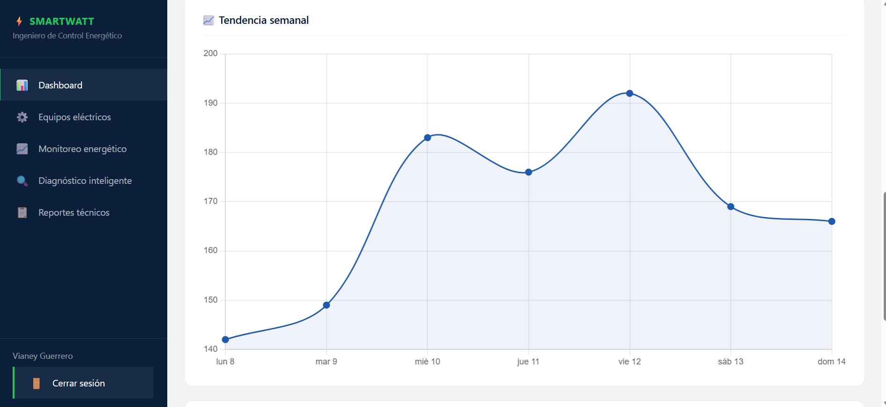

<b>Figura 4.</b> Grafica tendencia semanal.

En la parte inferior de la pantalla se encuentra la sección Incidencias recientes, la cual contiene una tabla con los reportes más recientes registrados en el sistema.

La tabla presenta la siguiente información:

- **Equipo**
- **Descripción**
- **Severidad**
- **Estado**
- **Fecha**

Esta sección permite al ingeniero consultar rápidamente los problemas detectados en los equipos y conocer el estado actual de cada incidencia.

  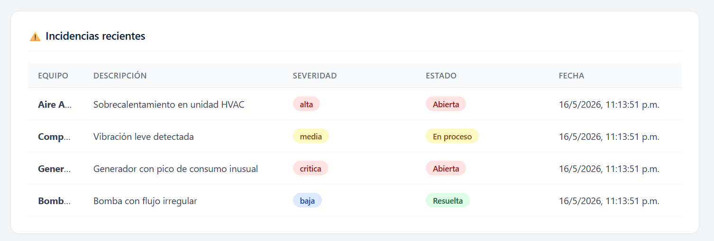

<b>Figura 5.</b> Visualizacion de incidencias tecnicas.

> **Nota:** El Dashboard es una pantalla exclusivamente de consulta y monitoreo, por lo que no permite realizar modificaciones directas sobre la información mostrada.
>

---

## Gestión de Equipos

La pantalla Gestión de Equipos permite administrar los equipos eléctricos registrados dentro del sistema. Desde este módulo es posible registrar nuevos equipos, consultar la información de los equipos existentes y gestionar su estado operativo.

En la parte superior de la pantalla se muestra el título Gestión de Equipos. A la derecha del encabezado se encuentra el botón Registrar nuevo equipo, el cual permite agregar nuevos equipos al sistema.

  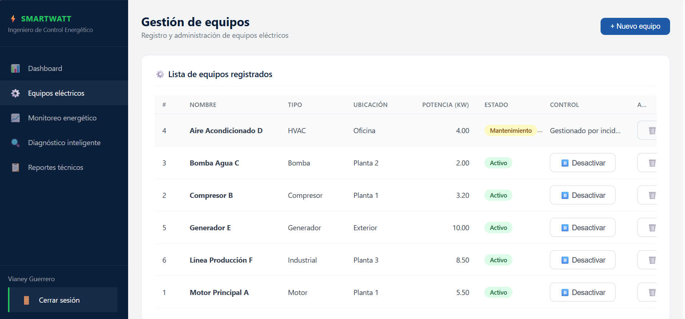

<b>Figura 6.</b> Gestión de equipos eléctricos.

### Registro de un nuevo equipo

Al seleccionar la opción Registrar nuevo equipo, se despliega un formulario de captura compuesto por los siguientes campos:

- **Nombre del equipo:** permite identificar el equipo dentro del sistema.
- **Tipo:** lista desplegable que permite seleccionar el tipo de equipo. Entre las opciones disponibles se encuentran compresor, motor eléctrico, transformador, bomba, entre otros.
- **Ubicación:** permite especificar la ubicación física donde se encuentra instalado el equipo.
- **Potencia nominal (kW):** permite registrar la potencia nominal del equipo expresada en kilowatts.
- 

En la parte inferior del formulario se encuentran los siguientes botones:

- **Guardar equipo:** almacena la información capturada en la base de datos.
- **Cancelar:** cierra el formulario sin registrar información.

  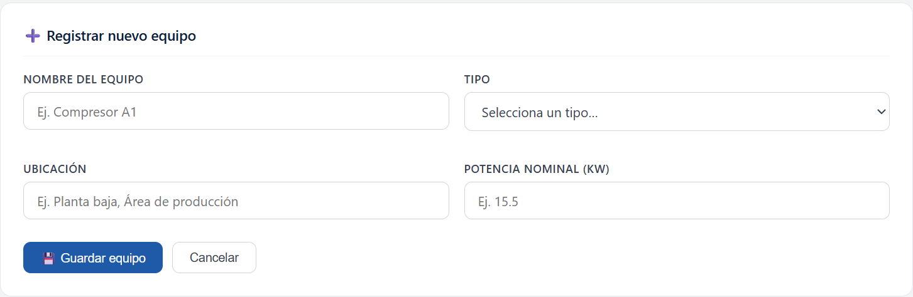

<b>Figura 7.</b> Registro de nuevos equipos.

Debajo del formulario se encuentra una tabla que muestra todos los equipos registrados en el sistema.

La tabla contiene las siguientes columnas:

- **Número**
- **Nombre**
- **Tipo**
- **Ubicación**
- **Potencia**
- **Estado**
- **Control**
- **Acción**
  

El campo Estado permite identificar la condición operativa del equipo, pudiendo ser:

- Activo
- Inactivo
- En mantenimiento
  

Dentro de la columna Control se encuentran las opciones para activar o desactivar equipos. Cuando un equipo es desactivado, su estado cambia automáticamente a **Inactivo** dentro del sistema.

La columna Acción permite eliminar registros de equipos cuando sea necesario.

Este módulo facilita la administración del inventario de equipos eléctricos y mantiene actualizada la información utilizada por el resto de las funcionalidades del sistema.

## Monitoreo Energético

La pantalla Monitoreo Energético tiene como finalidad permitir al Ingeniero de Control Energético supervisar el comportamiento energético de cada equipo registrado mediante la consulta de información en tiempo real e históricos de consumo.

En la parte superior de la pantalla se muestra el título Monitoreo Energético, acompañado del texto Últimos registros en tiempo real, indicando que la información presentada corresponde a los registros más recientes almacenados por el sistema.

Debajo del encabezado se encuentran tres tarjetas informativas que resumen la actividad reciente:

- **Último registro:** muestra el valor más reciente capturado.
- **Registros de hoy:** indica la cantidad de registros almacenados durante la fecha actual.
- **Promedio de hoy:** presenta el promedio de consumo calculado a partir de los registros del día.

  

<b>Figura 8.</b> Monitoreo energético.

Debajo de los indicadores se encuentran las opciones de control de la información:

- **Recargar:** actualiza la información mostrada para obtener los registros más recientes.
- **Última actualización:** muestra la fecha y hora de la última actualización realizada por el sistema.

Posteriormente se encuentra el campo Seleccionar equipo, el cual corresponde a una lista desplegable que contiene todos los equipos registrados previamente en el módulo Gestión de Equipos.

  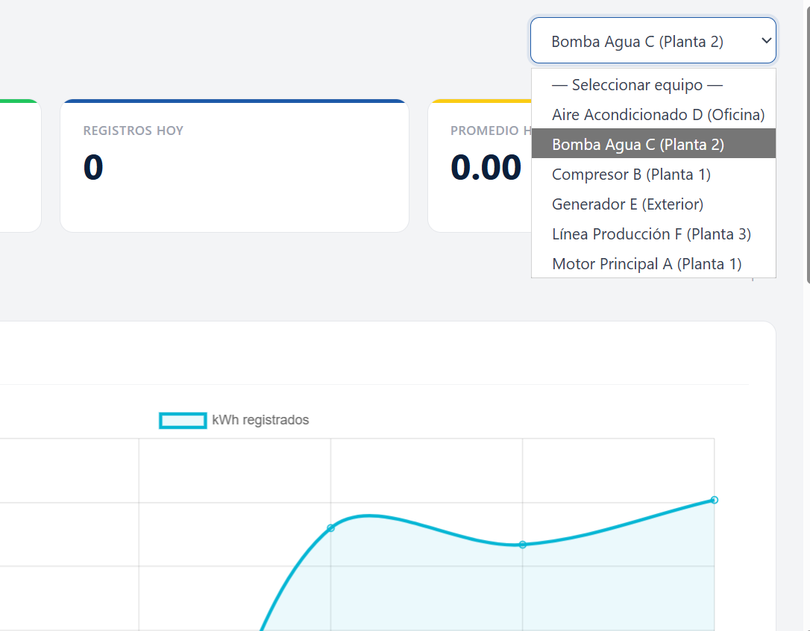

<b>Figura 9.</b> Menu para seleccionar equipo.

Cuando el usuario selecciona un equipo de la lista, el sistema carga automáticamente la información asociada a dicho equipo.

Debajo de la selección aparece una gráfica que representa la tendencia del consumo energético del equipo seleccionado.

En esta gráfica:

- El eje vertical muestra los valores de consumo registrados en **kWh**.
- El eje horizontal muestra las horas o momentos en que se realizaron las lecturas.

La gráfica permite visualizar el comportamiento energético del equipo a lo largo del tiempo y detectar posibles variaciones o anomalías en el consumo.

Finalmente, en la parte inferior de la pantalla se presenta una tabla de registros recientes correspondiente al equipo seleccionado.

La tabla contiene las siguientes columnas:

- **Número**
- **Equipo**
- **kWh**
- **Voltaje**
- **Corriente**
- **Factor de Potencia (FP)**
- **Fecha**

La información mostrada en esta tabla proviene de los registros capturados por el Técnico de Monitoreo mediante el módulo Registro de Consumo.

Este módulo proporciona una herramienta de análisis que permite supervisar el desempeño energético de los equipos y apoyar la toma de decisiones relacionadas con la eficiencia operativa.

---

## Diagnóstico Inteligente

La pantalla Diagnóstico Inteligente está diseñada para apoyar al Ingeniero de Control Energético en la supervisión del estado operativo de los equipos y en la detección de posibles anomalías.

En la parte superior de la pantalla se muestra el título Diagnóstico Inteligente, acompañado de una breve descripción del módulo.

Debajo del encabezado se encuentran cuatro tarjetas informativas:

- **Equipos normales:** cantidad de equipos que operan dentro de parámetros normales.
- **Alertas:** equipos que requieren revisión o seguimiento.
- **Estado crítico:** equipos que requieren atención inmediata.
- **Equipos inactivos:** equipos que actualmente se encuentran fuera de operación.

  

<b>Figura 10.</b> Diagnóstico Inteligente.

Debajo de los indicadores se encuentra la sección Estado de los equipos, donde se dispone de un filtro con las siguientes opciones:

- **Todos**
- **Normal**
- **Alertas**
- **Crítico**
- **Inactivos**

Al seleccionar cualquiera de estas opciones, el sistema actualiza automáticamente la información mostrada.

En la parte inferior se encuentra una tabla con las siguientes columnas:

- **Equipo**
- **Descripción**
- **Severidad**
- **Estado**
- **Reportada**
- **Acción**

El campo **Estado** puede presentar los siguientes valores:

- **Abierta**
- **En proceso**
- **Cerrada**

La columna Acción permite gestionar las incidencias registradas. Cuando una incidencia cambia al estado Cerrada, deja de considerarse activa dentro del sistema.

  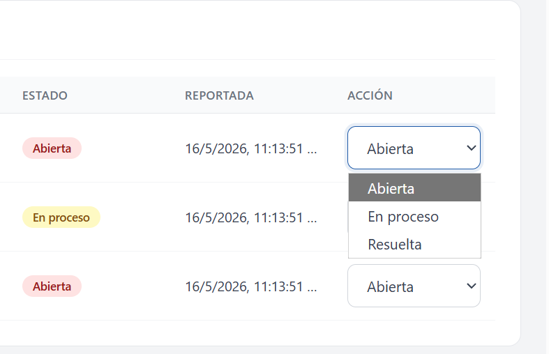

<b>Figura 11.</b> Gestion de incidencias.

Este módulo facilita la supervisión de equipos y la identificación de situaciones que puedan afectar el desempeño energético de la empresa.

---

## Reportes Técnicos

La pantalla Reportes Técnicos permite generar reportes consolidados del consumo energético registrado por los equipos durante un periodo determinado.

En la parte superior de la pantalla se muestra el título **Reportes Técnicos**.

Debajo del encabezado se encuentra la sección Periodo del reporte, la cual permite definir el rango de fechas que será utilizado para generar el informe.

Los controles disponibles son:

- **Fecha de inicio**
- **Fecha fin**
- **Generar reporte**

  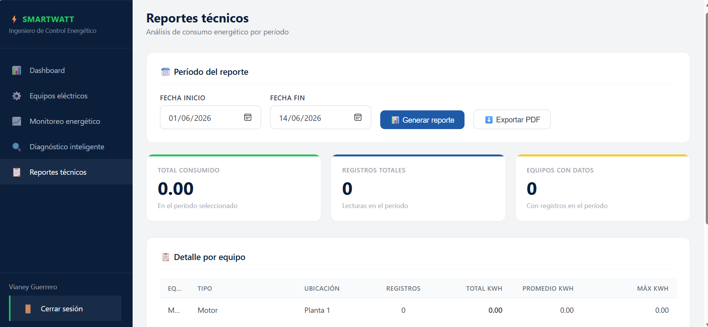

<b>Figura 12.</b> Reportes Técnicos.

Una vez generado el reporte, el sistema presenta un resumen con los siguientes indicadores:

- **Total consumido**
- **Registros totales**
- **Equipos con datos**

Posteriormente se muestra una tabla con la información de cada equipo:

- **Equipo**
- **Tipo**
- **Ubicación**
- **Registros**
- **Total kWh**
- **Promedio kWh**
- **Máximo kWh**

Finalmente, el módulo incorpora la opción Exportar PDF, la cual genera un documento con toda la información mostrada para su almacenamiento, consulta o impresión.

  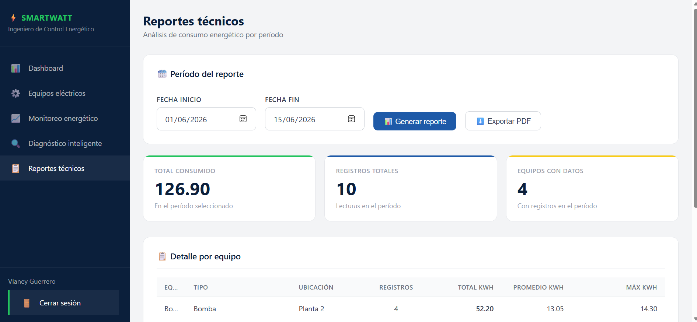

<b>Figura 13.</b> Exportacion PDF

Este módulo facilita la consulta histórica de la información energética y apoya la elaboración de informes técnicos para la toma de decisiones.

# Módulo del Técnico de Monitoreo

El Técnico de Monitoreo es el usuario encargado de capturar y reportar la información operativa que posteriormente será utilizada por el sistema para realizar el monitoreo, análisis y diagnóstico energético de los equipos eléctricos. Su función principal consiste en registrar las lecturas de consumo energético de los equipos y reportar cualquier incidencia o anomalía detectada durante la operación.

Para acceder a este módulo, el usuario debe iniciar sesión desde la pantalla principal del sistema utilizando las credenciales registradas previamente. Durante el proceso de registro se asigna el rol Técnico de Monitoreo, por lo que al ingresar correctamente su usuario y contraseña, el sistema lo redirige automáticamente a la interfaz correspondiente sin necesidad de seleccionar nuevamente su rol.

Dentro de este módulo, el técnico dispone de herramientas para registrar consumos energéticos, reportar incidencias y consultar la información de los equipos registrados en el sistema. La información capturada por el técnico es utilizada posteriormente por el Ingeniero de Control Energético para realizar análisis, monitoreo y generación de reportes.

---

## Registro de Consumo

La pantalla Registro de Consumo constituye la pantalla principal del módulo del Técnico de Monitoreo. Su objetivo es permitir la captura de lecturas energéticas de los equipos registrados dentro del sistema.

En la parte superior de la pantalla se muestra el título Registro de Consumo, acompañado de una descripción que indica que este módulo está destinado a la captura de lecturas energéticas de los equipos.

  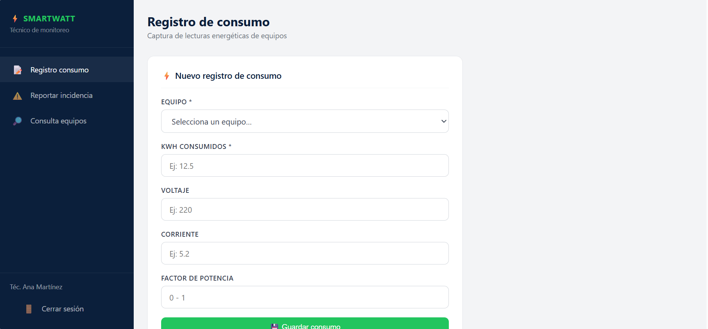

<b>Figura 14.</b> Registro de Consumo.

Debajo del encabezado se encuentra el formulario denominado Nuevo Registro de Consumo, el cual permite ingresar la información correspondiente a una lectura energética.

El formulario contiene los siguientes campos:

  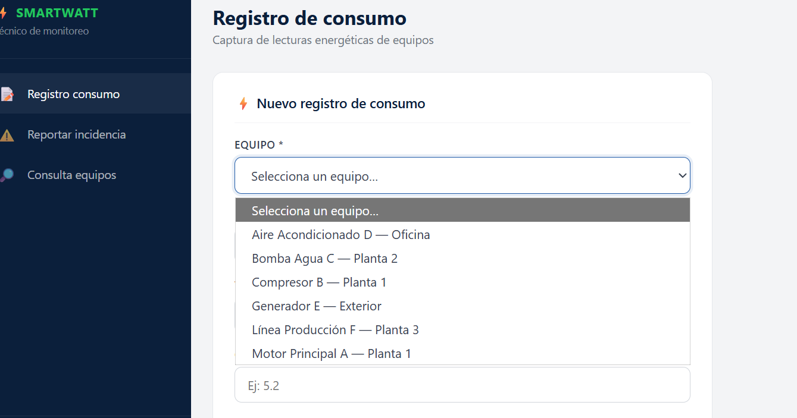

<b>Figura 15.</b> Lista de los equipos disponibles.

- **Equipo:** lista desplegable que muestra todos los equipos previamente registrados por el **Ingeniero de Control Energético** en el módulo **Gestión de Equipos**.

- **kWh consumidos:** campo destinado al registro de la energía consumida por el equipo.
- **Voltaje:** campo para registrar el voltaje medido durante la lectura.
- **Corriente:** campo para registrar la corriente eléctrica medida.
- **Factor de Potencia:** campo destinado a registrar el factor de potencia correspondiente al equipo.
  

Una vez completada la información, el usuario puede seleccionar el botón Guardar Consumo para almacenar el registro en la base de datos del sistema.

La información registrada mediante este módulo es utilizada posteriormente por el sistema para alimentar las gráficas de monitoreo energético, los indicadores del Dashboard y los reportes técnicos disponibles para el Ingeniero de Control Energético.

---

## Reportar Incidencia

La pantalla Reportar Incidencia permite al Técnico de Monitoreo registrar fallas, anomalías o situaciones que puedan afectar el funcionamiento normal de los equipos eléctricos.

En la parte superior se muestra el título Reportar Incidencia, seguido de la sección **Nueva Incidencia**, donde se encuentra el formulario de captura.

  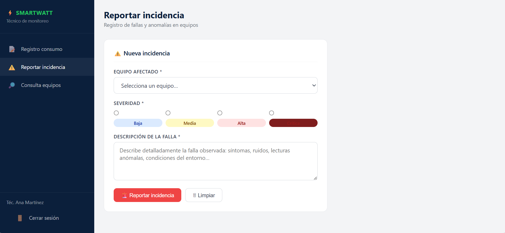

<b>Figura 16.</b> Reportar Incidencia.

El formulario está compuesto por los siguientes campos:

- **Equipo afectado:** lista desplegable que permite seleccionar el equipo sobre el cual se detectó la incidencia.
- **Severidad:** lista desplegable que permite clasificar la importancia de la incidencia.

Las opciones disponibles son:

- **Baja**
- **Media**
- **Alta**
- **Crítica**

Debajo de estos campos se encuentra el apartado Descripción de la falla, el cual consiste en un campo de texto donde el técnico puede detallar el problema identificado, proporcionando información relevante para su análisis y seguimiento.

En la parte inferior del formulario se encuentran dos botones:

- **Reportar Incidencia:** almacena la incidencia en el sistema.
- **Limpiar:** elimina la información capturada en el formulario para comenzar nuevamente el registro.

Una vez reportada la incidencia, esta queda disponible para su consulta dentro del módulo Diagnóstico Inteligente del Ingeniero de Control Energético, donde podrá ser analizada y gestionada.

---

## Consulta de Equipos

La pantalla Consulta de Equipos permite al Técnico de Monitoreo visualizar la información de todos los equipos registrados dentro del sistema sin necesidad de realizar modificaciones sobre ellos.

En la parte superior se muestra el título Consulta de Equipos, acompañado de una descripción que indica que esta sección funciona como un directorio general de los equipos registrados.

  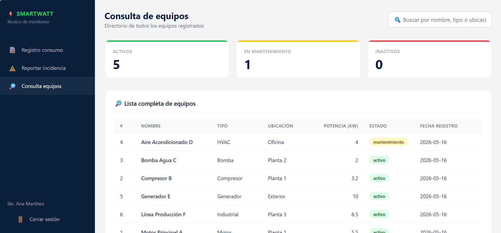

<b>Figura 17.</b> Consulta de Equipos.

Debajo del encabezado se encuentran tres tarjetas informativas que muestran un resumen del estado de los equipos registrados:

- **Activos:** cantidad de equipos que se encuentran operando.
- **En mantenimiento:** cantidad de equipos que se encuentran bajo revisión o mantenimiento.
- **Inactivos:** cantidad de equipos que actualmente no se encuentran en operación.

Estas tarjetas permiten al técnico conocer rápidamente la distribución de los equipos según su estado operativo.

En la parte inferior se encuentra la sección Lista completa de los equipos, donde se presenta una tabla con la información registrada para cada equipo.

La tabla contiene las siguientes columnas:

- **Número**
- **Nombre**
- **Tipo**
- **Ubicación**
- **Potencia**
- **Estado**
- **Fecha de registro**

Esta información permite al técnico consultar las características principales de cada equipo, así como verificar su estado actual dentro del sistema.

Al igual que las demás pantallas del módulo técnico, esta sección tiene fines informativos y de consulta, por lo que no permite modificar ni eliminar registros.

---

## Cierre de sesión

 

Al final del menú lateral del módulo del Técnico de Monitoreo se encuentra la opción Cerrar Sesión. Esta función permite finalizar de forma segura la sesión activa y regresar a la pantalla principal de inicio de sesión del sistema.

# Casos de Uso

---

## Caso de Uso 1. Inicio de Sesión

### Descripción

Este caso de uso permite que un usuario registrado acceda al sistema mediante sus credenciales. Una vez validados los datos de acceso, el sistema identifica el rol asignado al usuario y lo redirige automáticamente al módulo correspondiente.

### Actor

- **Ingeniero de Control Energético**
- **Técnico de Monitoreo**

### Flujo principal

1. El usuario accede a la pantalla de inicio de sesión.
2. Ingresa su nombre de usuario.
3. Ingresa su contraseña.
4. Selecciona la opción **Iniciar sesión**.
5. El sistema valida las credenciales.
6. El sistema identifica el rol del usuario.
7. El sistema redirige al módulo correspondiente.

### Resultado esperado

El usuario accede correctamente a la plataforma y visualiza las funciones correspondientes a su rol.

  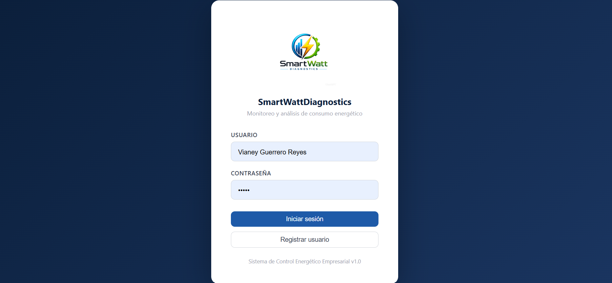

<b>Figura 18.</b> Inicio de sesión.

  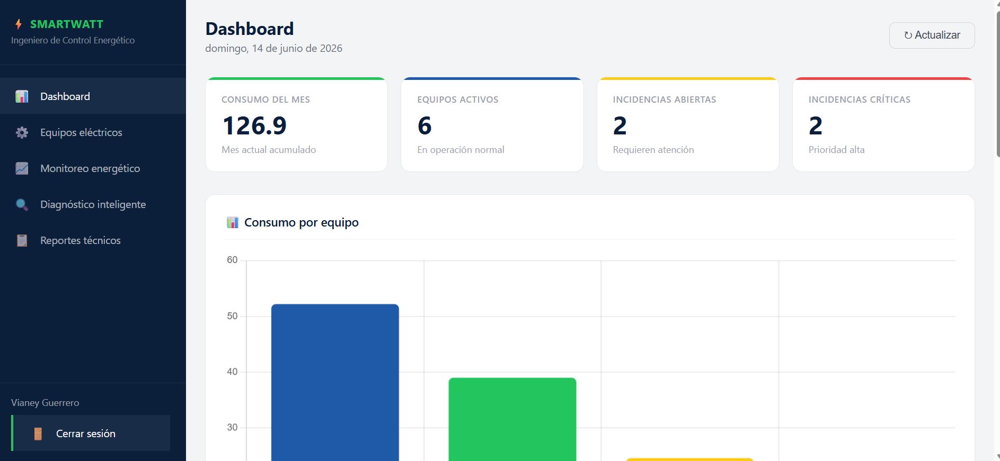

<b>Figura 19.</b> Inicio de sesión.

---

## Caso de Uso 2. Registrar Equipo Eléctrico

### Descripción

Este caso de uso permite al Ingeniero de Control Energético registrar nuevos equipos dentro del sistema para que puedan ser monitoreados y considerados en los procesos de análisis energético.

### Actor

- **Ingeniero de Control Energético**

### Flujo principal

1. El ingeniero accede al módulo **Gestión de Equipos**.
2. Selecciona la opción **Registrar nuevo equipo**.
3. Ingresa el nombre del equipo.
4. Selecciona el tipo de equipo.
5. Especifica la ubicación.
6. Registra la potencia nominal.
7. Presiona el botón **Guardar equipo**.
8. El sistema almacena la información.
9. El equipo aparece en la lista de equipos registrados.

### Resultado esperado

El equipo queda registrado y disponible para futuras capturas de consumo y monitoreo.

  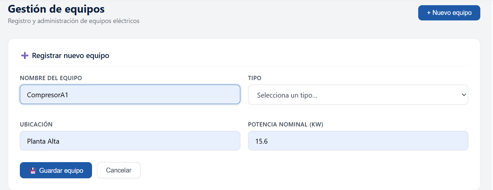

<b>Figura 20.</b> Registro de equipos.

  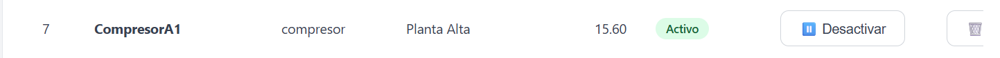

<b>Figura 21.</b> Registro de equipos.

---

## Caso de Uso 3. Registrar Consumo Energético

### Descripción

Este caso de uso permite al Técnico de Monitoreo capturar las lecturas energéticas de los equipos registrados. La información almacenada es utilizada posteriormente para el monitoreo, diagnóstico y generación de reportes.

### Actor

- **Técnico de Monitoreo**

### Flujo principal

1. El técnico accede al módulo **Registro de Consumo**.
2. Selecciona un equipo de la lista disponible.
3. Captura el valor de **kWh consumidos**.
4. Registra el voltaje medido.
5. Registra la corriente medida.
6. Captura el factor de potencia.
7. Presiona el botón **Guardar Consumo**.
8. El sistema almacena la información registrada.

### Resultado esperado

La lectura energética queda registrada correctamente y puede ser consultada desde los módulos de monitoreo y análisis.

  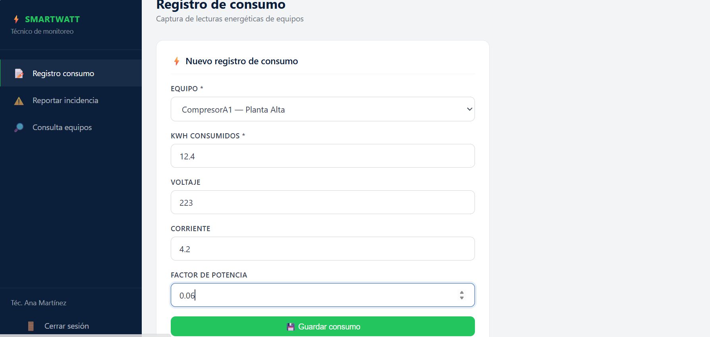

<b>Figura 22.</b> Registro de consumo energético.

  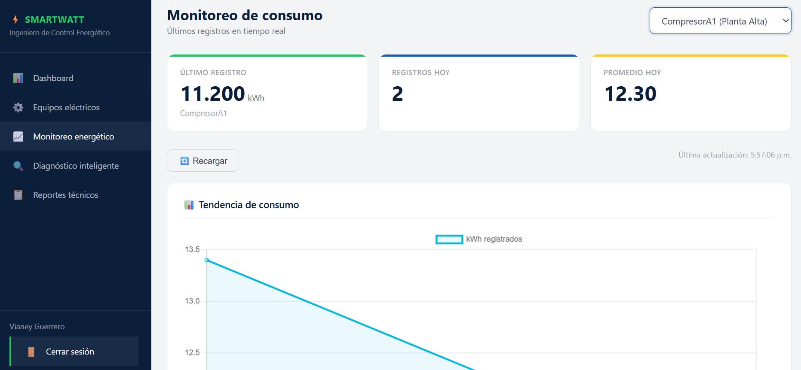

<b>Figura 23.</b> Registro de consumo energético.

---

## Caso de Uso 4. Generar Reporte Técnico

### Descripción

Este caso de uso permite al Ingeniero de Control Energético generar reportes de consumo energético utilizando la información registrada en el sistema durante un periodo específico.

### Actor

- **Ingeniero de Control Energético**

### Flujo principal

1. El ingeniero accede al módulo **Reportes Técnicos**.
2. Selecciona la fecha de inicio.
3. Selecciona la fecha de fin.
4. Presiona el botón **Generar reporte**.
5. El sistema procesa la información del periodo seleccionado.
6. Se muestran los indicadores generales y el detalle por equipo.
7. El usuario selecciona la opción **Exportar PDF**.
8. El sistema genera el archivo PDF correspondiente.

### Resultado esperado

Se obtiene un reporte técnico con información consolidada del consumo energético registrado durante el periodo seleccionado.

  

<b>Figura 24.</b> Generación de reporte técnico.

  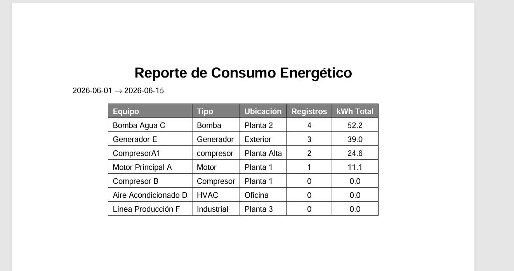

<b>Figura 25.</b> Reporte exportado en formato PDF.
